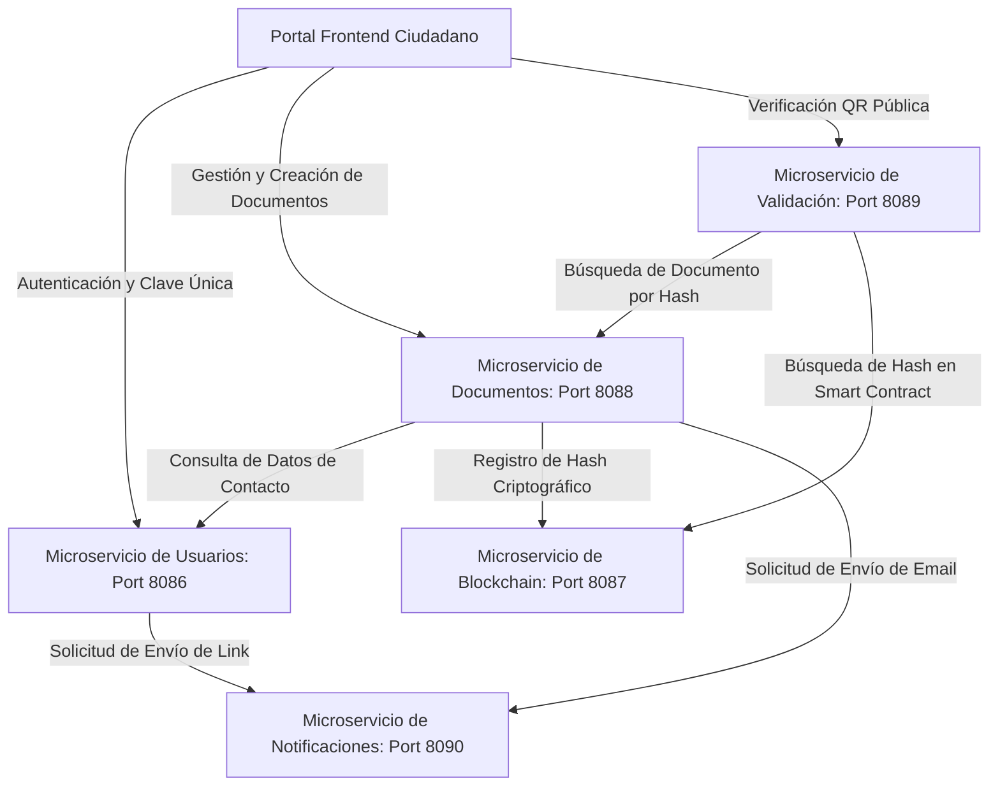

# Índice de Arquitectura y Patrones de Diseño: Municipalidad Digital Backend

Esta carpeta contiene la documentación detallada, independiente y segura de cada uno de los microservicios que componen el backend de la plataforma **Municipalidad Digital**.

Para un análisis exhaustivo de la lógica interna, DTOs y reglas de negocio específicas de cada microservicio, consulta los siguientes documentos técnicos independientes:

---

## 🗂️ Catálogo de Arquitectura por Componente

*   🔑 **[Microservicio de Usuarios (`usuarios`)](usuarios.md):** Gestiona el inicio de sesión, el simulador de ClaveÚnica, el modelo de perfiles y la firma criptográfica centralizada mediante JWT (Puerto **`8086`**).
*   📄 **[Microservicio de Documentos (`documentos`)](documentos.md):** Modela la lógica polimórfica de los trámites (joined-table inheritance), el pipeline de firmado digital y la generación interactiva de archivos PDF e imágenes QR con ZXing (Puerto **`8088`**).
*   ✉️ **[Microservicio de Notificaciones (`notificacion`)](notificacion.md):** El motor modular y **stateless** encargado del envío asíncrono y seguro de correos dinámicos responsivos con soporte para mock-SMTP e intercepción de seguridad JWT/RBAC (Puerto **`8090`**).
*   ⛓️ **[Microservicio de Blockchain (`blockchain`)](blockchain.md):** Middleware Web3j encargado del sellado inmutable en el Smart Contract del nodo Hardhat local (Puerto **`8087`**).
*   🛡️ **[Microservicio de Validación (`validacion`)](validacion.md):** Validador público descentralizado que contrasta la huella digital física del documento contra el registro de la Blockchain (Puerto **`8089`**).

---

## 🏛️ 1. Topología de Red y Puertos del Ecosistema

El backend de la plataforma está diseñado bajo una arquitectura de microservicios distribuidos desacoplados. A continuación, se detallan los puertos utilizados por cada componente del ecosistema:

| Servicio / Infraestructura | Puerto | Tipo | Propósito |
| :--- | :--- | :--- | :--- |
| **`usuarios`** | **`8086`** | API REST | Control de identidades, logins y ClaveÚnica. |
| **`blockchain`** | **`8087`** | Web3 Middleware | Registro inmutable de transacciones en Smart Contract. |
| **`documentos`** | **`8088`** | API REST | Generador de PDF/QR, firma digital y flujo de aprobaciones. |
| **`Validacion`** | **`8089`** | API REST | Portal público para auditorías criptográficas de fe pública. |
| **`notificacion`** | **`8090`** | API REST | Motor stateless de envíos de correos responsivos en HTML. |
| **Nodo Hardhat** | **`8545`** | JSON-RPC | Red descentralizada local Ethereum de desarrollo. |
| **PostgreSQL Usuarios** | **`5432`** | Base de Datos | Base de datos dedicada y aislada de identidades. |
| **PostgreSQL Documentos** | **`5433`** | Base de Datos | Base de datos dedicada de metadatos de trámites. |

---

## 🏛️ 2. Arquitectura General y Mapa de Interacciones

El flujo lógico del sistema promueve el desacoplamiento masivo, permitiendo que cada nodo atienda responsabilidades lógicas diferenciadas:

---

## ⚙️ 3. Patrones de Diseño de Software Empresarial

Se implementan los siguientes patrones de diseño de software a nivel de sistema para garantizar modularidad y mantenibilidad:

### A. Arquitectura en Capas (Layered Architecture)
Cada microservicio Spring Boot organiza su lógica interna en tres niveles separados:
*   **Controller (Presentación):** Clases que mapean los endpoints HTTP/REST, controlan las respuestas y validan el formato de entrada sin tocar la persistencia física.
*   **Service (Negocio):** Orquestadores lógicos donde residen las reglas de validación municipales, encriptación, hashes y flujos transaccionales.
*   **Repository (Datos):** Interfaces Spring Data JPA que administran consultas parametrizadas óptimas a base de datos.

### B. Objeto de Transferencia de Datos (DTO Pattern)
Clases exclusivas de transferencia que encapsulan los payloads de la red:
*   Evita exponer detalles del modelo relacional físico en la interfaz o redes externas.
*   Regula estrictamente los contratos de API y previene la alteración maliciosa de campos internos mediante sobreescritura de peticiones HTTP.

### C. Patrón de Servicio Stateless (Stateless Service Pattern)
Los servicios de auditoría y notificaciones (`validacion` y `notificacion`) operan sin persistir estado en memoria local ni en base de datos:
*   Validan accesos y roles criptográficamente en memoria descodificando los tokens JWT recibidos, lo que permite un escalamiento horizontal masivo.

### D. Patrón Filtro e Interceptor (Filter Pattern)
Spring Security intercepta todas las peticiones protegidas mediante filtros de ciclo único:
*   Lee la cabecera del token de seguridad y asume la autenticación en el contexto seguro local si la firma es legítima, liberando a los controladores de la lógica de seguridad.

### E. Polimorfismo en Base de Datos (Joined-Table Inheritance)
El microservicio de documentos agrupa metadatos comunes en una tabla base e implementa tablas secundarias para las propiedades de cada subtipo de trámite, unificando el modelo físico a través de llaves primarias referenciales de base de datos.

---

## 🔒 4. Modelo de Seguridad: Centralización JWT y RBAC

La plataforma implementa un modelo robusto de **Control de Accesos Basado en Roles (RBAC)** y **Firma de Confianza Centralizada**:

1.  **Centralización de Credenciales:** El microservicio `usuarios` valida identidades locales o estatales (ClaveÚnica) y es el único emisor del token JWT firmado. Este token incluye la identidad (RUT) y el rol de usuario correspondiente en sus Claims.
2.  **Verificación Stateless Local:** Microservicios intermedios (`documentos`, `notificacion`) validan la autenticidad del JWT en memoria local mediante la clave secreta compartida (`jwt.secret`), eliminando latencias por consultas de red.
3.  **Matriz de Roles:**
    *   **`ROLE_VECINO`:** Ciudadanos comunes. Permisos básicos para solicitar y consultar salvoconductos y actas residenciales de su propiedad.
    *   **`ROLE_FUNCIONARIO`:** Personal de oficina municipal. Autorización para revisar borradores, inyectar firmas y generar PDF oficiales.
    *   **`ROLE_ADMIN`:** Administrador principal del portal. Permisos totales de auditoría, control de accesos e interconexiones Blockchain globales.
