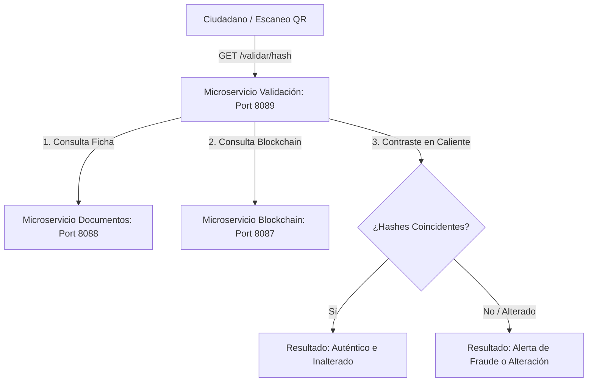

# Arquitectura de Verificación: Microservicio de Validación (`Validacion`)

El microservicio de **Validación** es un componente público, modular y puramente **stateless** (sin base de datos) diseñado específicamente para proveer fe pública de los trámites digitales municipales impresos o electrónicos. Su misión exclusiva es contrastar la veracidad física de los archivos de manera offline y online.

---

## 1. Topología de Red y Puertos
*   **Puerto del Servicio:** Se ejecuta en el puerto **`8089`** recibiendo las consultas de ciudadanos desde navegadores o escaneos QR desde dispositivos móviles.

---

## 2. Patrones Arquitectónicos y Aplicación en el Código

Este componente modular ha sido diseñado bajo patrones orientados a la auditoría e integridad de la información:

### Patrón Stateless Auditor (Auditor Sin Estado)
El microservicio no requiere persistencia física local ni mantiene una base de datos propia de documentos. Funciona como un procesador intermedio que audita la información al vuelo:
*   **Integración por Scan QR:** Al recibir el hash SHA-256 codificado en el código QR de un documento impreso o electrónico, el controlador REST recibe la consulta pública.
*   **Contraste de Fe Pública Municipal:** Realiza una llamada REST interna al microservicio de documentos en puerto `8088` para corroborar si la ficha oficial del trámite existe y coincide con los metadatos.
*   **Contraste de Fe Pública Descentralizada:** Realiza una llamada al microservicio de blockchain en puerto `8087` para leer directamente desde el Smart Contract si la huella digital (hash SHA-256) está grabada en la red local y corresponde a una transacción exitosa de Blockchain en estado confirmado.
*   **Informe de Integridad:** Contrasta de manera lógica ambos resultados. Si existe coincidencia absoluta de hashes, el sistema certifica el estado de integridad como **Auténtico, inalterado y oficial**. En caso de discordancia o ausencia de registros en la red descentralizada, arroja de inmediato un reporte detallando una potencial alteración fraudulenta del documento.

### Casos de Auditoría Lógica en Caliente
*   **Documento Válido:** Al escanearse el QR, la validación confirma que el PDF existe en el repositorio oficial municipal de documentos y que la Blockchain tiene exactamente grabada la huella SHA-256 original, arrojando validez legal completa.
*   **Documento Alterado:** Si un actor malicioso modifica digitalmente un PDF impreso (por ejemplo, alterando montos, fechas o beneficiarios de un contrato), al calcularse la firma del hash SHA-256 en el validador, este hash no coincidirá con la transacción criptográfica inmutable de la Blockchain. El auditor de integridad alerta inmediatamente de la adulteración física.
